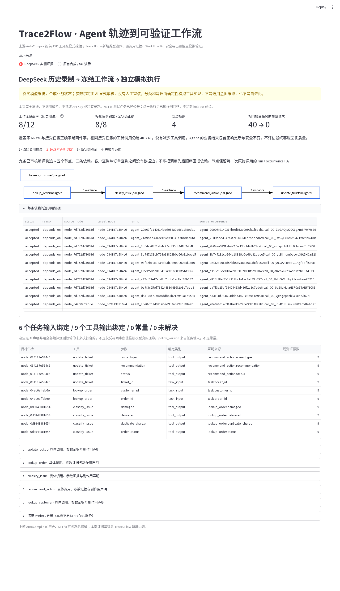
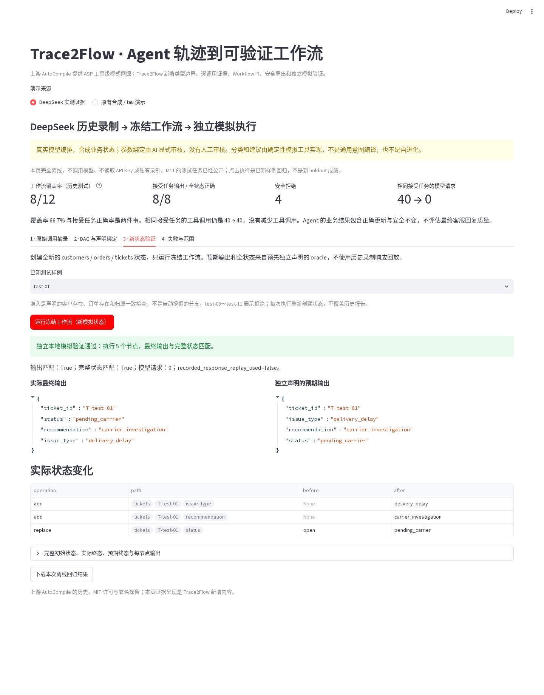
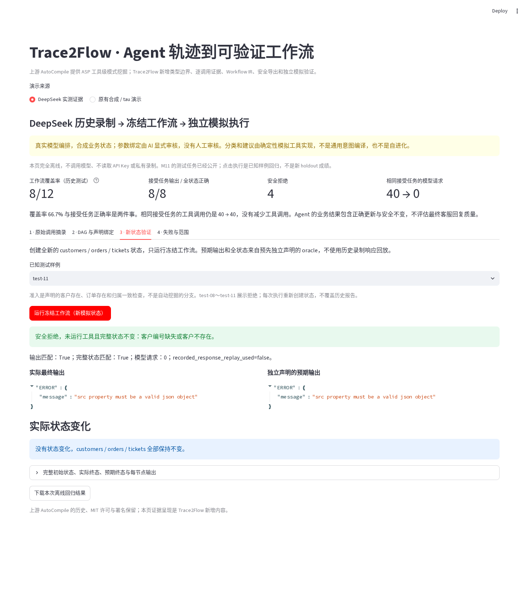

# Trace2Flow：把 Agent 执行轨迹编译成可验证工作流

> 一个面向 Agent 工程化的实验项目：从多次工具调用轨迹中提取可复用结构，生成带证据、可审查、可安全执行的工作流，并在独立本地状态中验证结果与副作用。

[](https://www.python.org/)
[](docs/STATUS.md)
[](LICENSE)
[](https://github.com/mirkokiefer/autocompile)

Trace2Flow 不是另一个 Agent 框架。它位于 Agent 的下游：观察 Agent 已经完成的同类任务，把其中有充分证据、经过审核的稳定路径固化为工作流；遇到歧义或未覆盖请求时，仍回退给 Agent。

## 为什么做这个项目

LLM Agent 能处理开放问题，但在客服查询、订单核验等重复任务中，每次都重新规划会带来几个工程问题：

- 相同业务被反复推理，模型调用和 token 消耗难以控制；
- 工具调用顺序不等于真实数据依赖，直接“照抄轨迹”容易生成错误流程；
- 历史参数看起来不变，不代表它就是业务常量；
- 工作流能否正确更新状态，不能只靠回放历史响应证明；
- 自动生成的流程一旦包含歧义、越权工具或未确认副作用，就不应该执行。

Trace2Flow 的核心思路是：**高频模式只是候选证据，不是执行许可。** 系统保留每次工具调用的 occurrence ID、参数类型和依赖来源；无法确认的绑定保持 unresolved，并阻止导出可执行版本。

```text
自然语言请求
     │
     ▼
标准 LangChain Agent ──调用本地工具──► 原始执行轨迹
     │                                  │
     │                            规范化 / 审核
     │                                  ▼
     │                   AutoCompile ASP 模式挖掘（上游）
     │                                  │
     │                                  ▼
     │                   occurrence-aware 候选 DAG
     │                                  │
     │                         参数绑定与副作用声明
     │                                  ▼
     └────不确定时回退◄──── 安全路由 ─── Workflow IR
                                      │
                              Prefect 导出 / 本地执行
                                      │
                                      ▼
                            输出 + 完整状态独立验证
```

## 效果展示

下面截图来自仓库内真实的 Streamlit 离线演示，不是设计稿。默认页面展示归档的 DeepSeek 工具编排轨迹、冻结工作流和独立本地模拟执行；启动演示不需要 API Key，也不会发起模型请求。

### 1. 从轨迹得到带证据的 DAG 与参数绑定

每条边都能展开到支持它的运行 ID 和调用 ID。同一个工具被调用多次时不会仅按工具名合并；没有证据的数据依赖不会因为调用先后顺序被补出来。



### 2. 在全新模拟状态中验证输出与副作用

验证阶段重新创建 customers、orders、tickets 状态，执行冻结工作流，同时比较业务输出和完整状态差异；它不回放历史工具响应。



### 3. 不确定时安全拒绝

缺少客户身份或归属证据时，工作流不会猜测或写入，工具调用数为 0，完整状态保持不变。



更多原始调用、重复失败和零调用截图见[中文演示手册](docs/LIVE_DEMO_WALKTHROUGH.md)。

## 已实现能力

| 模块 | 能力 |
|---|---|
| Trace 输入 | Pydantic 定义的版本化 JSON Schema；保留对象、数组、布尔、数字与 `null` 等原始类型 |
| 数据集边界 | 按完整任务运行和来源任务组切分；检测 compile/test 泄漏 |
| 结构挖掘 | 调用上游 Clingo/ASP 编译器，再按调用 occurrence 对齐候选节点 |
| 证据 DAG | 每条依赖保存支持/冲突运行及调用证据；调用顺序不自动成为数据依赖 |
| Workflow IR | 与 LangChain、Prefect 解耦的 Pydantic IR；支持任务输入、常量、前序工具输出和 unresolved 绑定 |
| 安全导出 | 仅在关键项全部解决后导出 Prefect；运行时只允许调用显式注册工具 |
| 独立验证 | 在新的本地模拟状态中比较最终输出、完整状态与状态 diff |
| Agent 集成 | 标准 LangChain/LangGraph 客服 Agent、人工审批写入、保守路由与 Agent fallback |
| 演示与评估 | Streamlit 证据界面、冻结评估计划、公开的脱敏报告与失败样本 |

## 实际结果

项目没有预设“加入工作流一定提高准确率”，以下数字均来自仓库内冻结的合成业务实验。

### 冻结工作流验证（M11）

| 指标 | 结果 |
|---|---:|
| 历史测试任务覆盖 | 8 / 12 |
| 被接受任务的输出正确 | 8 / 8 |
| 被接受任务的完整状态正确 | 8 / 8 |
| 安全拒绝 | 4 |
| 相同 8 个接受任务的模型编排请求 | 40 → 0 |
| 相同 8 个接受任务的工具调用 | 40 → 40 |

这里证明的是：在一个狭窄、已审核的合成客服流程中，在线模型编排可以被工作流替代；它不代表工具调用减少，也不是生产准确率或成本结论。

### Agent 与 Agent + Trace2Flow 成对评估（M13c）

| 指标 | 标准 Agent | Agent + Trace2Flow |
|---|---:|---:|
| 总体正确 | 4 / 6 | 4 / 6 |
| 完整状态正确 | 6 / 6 | 6 / 6 |
| 模型调用 | 23 | 15 |
| 输入 + 输出 token | 37,321 | 24,223 |
| 工具调用 | 27 | 27 |
| 累计墙钟时间 | 66.49 s | 46.47 s |
| 工作流覆盖 | 0 / 6 | 2 / 6 |

本轮准确率没有提升。Trace2Flow 在 2 个明确的配送延迟请求上安全命中已审核工作流，因此总模型调用减少 8 次、供应商报告 token 减少 13,098；样本仅 6 个且全部为合成任务，不能外推到生产环境。完整协议和失败分析见[成对评估报告](docs/PAIRED_AGENT_EVALUATION.md)。

### 公共数据集兼容性实验（M14）

项目审计了 τ³ retail 的 114 个公开模拟任务，并按实体关联组固定为 48 个 compile、26 个 development 和 40 个封存 test。最终 DeepSeek 开发批次只有 1/6 成功且出现 5 次协议违规，未达到预先声明的开启门槛，因此 **40 个官方 test 保持封存，没有虚构公开榜单成绩**。详见[公共数据集扩展记录](docs/PUBLIC_DATASET_EXPANSION.md)。

## 技术选型

| 技术 | 在项目中的作用 | 选择原因 |
|---|---|---|
| Python 3.12 | 主开发语言 | 类型生态和 Agent/数据工具链成熟 |
| Pydantic v2 | Trace Schema 与 Workflow IR | 严格类型、可序列化、错误信息清晰 |
| Clingo / ASP | 模式挖掘与冲突优化 | 复用 AutoCompile 上游能力，显式表达约束与优化目标 |
| LangChain + LangGraph | 标准 Agent、工具循环、状态与 HITL | 使用成熟框架，不自建 Agent runtime |
| DeepSeek | 可选的真实模型轨迹生产者 | 通过 OpenAI-compatible 接口接入；离线演示不依赖模型 |
| Prefect 3 | 工作流导出目标 | 提供清晰任务边界，同时由 Trace2Flow 注册表限制可调用工具 |
| Streamlit | 招聘演示与证据检查界面 | 单仓库即可展示轨迹、DAG、绑定和状态 diff |
| `unittest` + Ruff | 回归测试与静态检查 | 标准库测试可移植，CI 路径简单 |
| uv | 锁定依赖与可复现环境 | `uv.lock` 固定完整依赖图 |

## 快速运行

### 环境要求

- Python 3.12
- [uv](https://docs.astral.sh/uv/)
- Git

### 1. 克隆并安装

```bash
git clone https://github.com/JiaDodo/trace2flow.git
cd trace2flow
uv sync --locked --group dev
```

### 2. 启动离线演示（推荐）

```bash
PYTHONPATH=src uv run streamlit run streamlit_app.py \
  --server.address 127.0.0.1 \
  --server.port 8512 \
  --browser.gatherUsageStats false
```

浏览器打开 <http://127.0.0.1:8512>。默认的“DeepSeek 实测证据”页面只读取仓库内公开归档，不读取 `DEEPSEEK_API_KEY`，也不会请求任何外部服务。

### 3. 运行完整测试

```bash
PYTHONPATH=src PREFECT_SERVER_ALLOW_EPHEMERAL_MODE=true \
  uv run python -m unittest discover -s tests -v

uv run ruff check src/trace2flow tests streamlit_app.py \
  scripts/capture_m12_demo.py
```

当前冻结基线为 **196 tests passed，0 skips**。实际命令与结果记录在 [`docs/STATUS.md`](docs/STATUS.md)。

## 从 Trace 到工作流：最小命令行示例

下面路径完全离线，使用仓库内类型化测试数据：

```bash
# 1. 校验规范化 JSON Trace，不执行其中任何内容
PYTHONPATH=src uv run python -m trace2flow validate \
  tests/fixtures/typed_customer_support.json

# 2. 调用上游编译器并生成带逐调用证据的候选 DAG
PYTHONPATH=src uv run python -m trace2flow mine \
  tests/fixtures/typed_customer_support.json \
  --output /tmp/trace2flow-candidate.json \
  --rule-profile strict

# 3. 构建框架无关 Workflow IR
PYTHONPATH=src uv run python -m trace2flow build-ir \
  tests/fixtures/typed_customer_support.json \
  --candidate /tmp/trace2flow-candidate.json \
  --output /tmp/trace2flow-workflow.json
```

如果关键参数、分支或副作用仍为 unresolved，第三步可以保留候选 IR，但 Prefect 可执行导出会被拒绝。完整本地验证流程见 [`docs/LOCAL_VERIFICATION.md`](docs/LOCAL_VERIFICATION.md)。

## 可选：运行 DeepSeek Agent

Agent 是轨迹生产者，不是编译器本身。只有这一部分需要模型 Key：

```bash
uv sync --locked --extra agent --group dev
export DEEPSEEK_API_KEY="你的 Key"

PYTHONPATH=src uv run --extra agent python -m trace2flow.support_agent \
  --customer-id C-100 \
  --ticket-id T-100 \
  --message "我上周买的蓝牙耳机咋还没到啊？物流好几天没动了" \
  --thread-id demo-01 \
  --approve-local-write \
  --allow-paid-call \
  --trace-output data-private/standard-agent-demo/delivery.json
```

实时调用必须显式传入 `--allow-paid-call`。程序不会把 Key、请求头或供应商异常原文写入录制；本地写操作仍需人工批准。详细说明见[标准客服 Agent](docs/STANDARD_AGENT.md)。

## 项目结构

```text
trace2flow/
├── src/
│   ├── compile.py                 # 上游 AutoCompile / Clingo 编译入口
│   └── trace2flow/
│       ├── models.py              # 规范化 Trace 数据模型
│       ├── candidate.py           # occurrence-aware 候选 DAG
│       ├── ir.py                  # Pydantic Workflow IR
│       ├── prefect_export.py      # 注册工具约束下的 Prefect 导出
│       ├── simulation.py          # 客服本地模拟与状态验证
│       ├── support_agent.py       # 标准 LangChain/LangGraph Agent
│       └── support_router.py      # 工作流优先、歧义回退 Agent 的路由
├── rules/                         # 上游 ASP 规则
├── tests/                         # 离线回归与安全边界测试
├── examples/                      # 合成、录制和冻结评估产物
├── docs/                          # 审计、实验协议、路线图与演示手册
├── streamlit_app.py               # 离线可视化入口
├── pyproject.toml
└── uv.lock
```

## 上游项目与新增内容的边界

本仓库 fork 自 [mirkokiefer/autocompile](https://github.com/mirkokiefer/autocompile)，保留原始 Git 历史、MIT License 和署名。

| AutoCompile 上游原有能力 | Trace2Flow 新增能力 |
|---|---|
| Clingo/ASP 工具级模式挖掘 | 类型化 JSON Trace 与完整运行级数据边界 |
| core tool、顺序/冲突、条件等统计模式 | 同名重复调用不合并的 occurrence 对齐 |
| 原始 benchmark 与 pseudo/Daslab codegen | 每条 DAG 依赖的逐运行、逐调用证据 |
| ASP 规则与实验性 Datalog 后端 | Pydantic Workflow IR 与显式 unresolved 状态 |
| 上游示例数据 | 安全 Prefect 导出、注册工具运行时、独立状态验证 |
| — | 标准客服 Agent、保守自适应路由、Streamlit 演示与冻结评估 |

上游真实输入输出、已验证能力和实现限制见 [`docs/UPSTREAM_AUDIT.md`](docs/UPSTREAM_AUDIT.md)。Trace2Flow 没有未经核验重写上游编译核心。

## 安全与正确性边界

- Trace 中携带的代码永远不会被执行；运行时只能调用预注册的本地工具。
- 调用顺序和相同字段值都不能单独证明数据血缘。
- 布尔值、空值和常见数字等弱匹配保持歧义，不静默猜测。
- 历史参数不变不等于业务常量；常量和运行时输入需要显式声明。
- 有 unresolved 参数、分支或副作用时拒绝可执行导出。
- compile 与 test 按完整任务运行隔离；同一来源任务组不能跨分区。
- 当前客服数据全部为合成业务数据；录制模型调用不等于真实客户数据。
- 不连接真实客服系统，不发消息、不退款、不联系承运商，也不执行通用 Shell。

## 当前状态与下一步

M0–M12 已完成原 MVP、DeepSeek 轨迹采集、冻结评估与离线演示；M13 已完成标准 Agent、保守路由和首轮成对评估；M14 完成公共 τ³ 数据审计并诚实关闭未达门槛的兼容性实验。

下一项明确工作是 **M13d**：修复 Agent 与工作流共享的用户可见结果协议，然后冻结一批更大、任务组互斥的改写/负例 holdout，重新评估语义准确率、完整状态、调用、token 和安全写入。详见[路线图](docs/ROADMAP.md)和[当前状态](docs/STATUS.md)。

## 文档导航

- [三分钟中文演示与截图复现](docs/LIVE_DEMO_WALKTHROUGH.md)
- [项目证据链与面试讲解](docs/PORTFOLIO_WALKTHROUGH.md)
- [Agent + Trace2Flow 成对评估](docs/PAIRED_AGENT_EVALUATION.md)
- [自适应路由设计](docs/ADAPTIVE_ROUTER.md)
- [Workflow IR 与 Prefect 安全导出](docs/PREFECT_EXPORT.md)
- [公共数据集扩展与负结果](docs/PUBLIC_DATASET_EXPANSION.md)
- [上游能力审计](docs/UPSTREAM_AUDIT.md)

## License 与致谢

本项目采用 [MIT License](LICENSE)。感谢 [Mirko Kiefer](https://github.com/mirkokiefer) 开源的 [AutoCompile](https://github.com/mirkokiefer/autocompile)；Trace2Flow 在保留其历史和署名的基础上进行工程化扩展。
