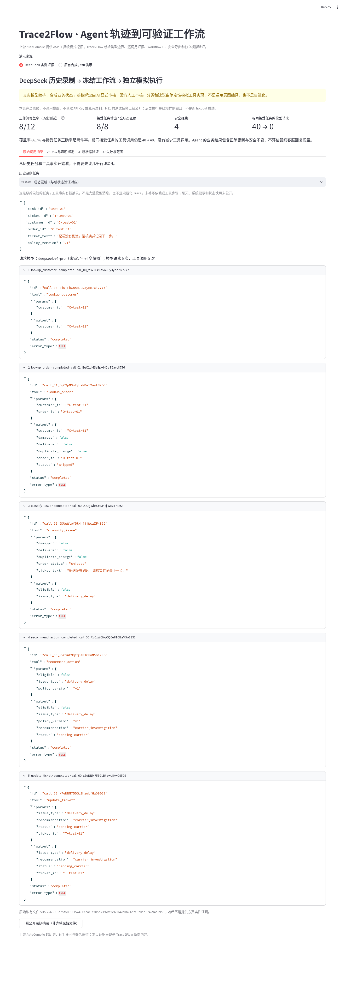
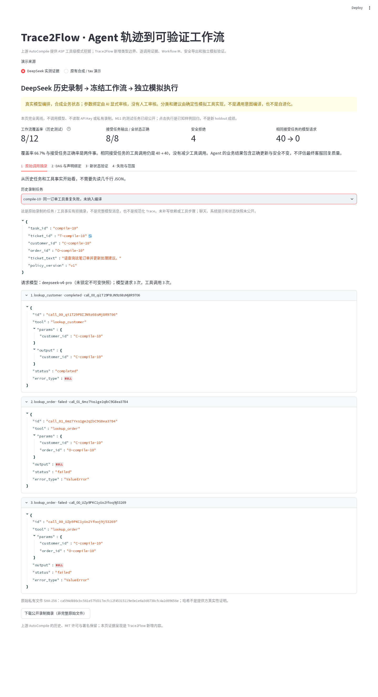
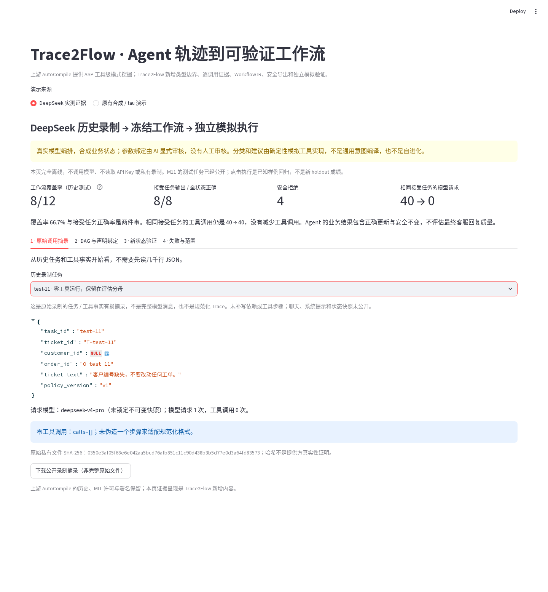
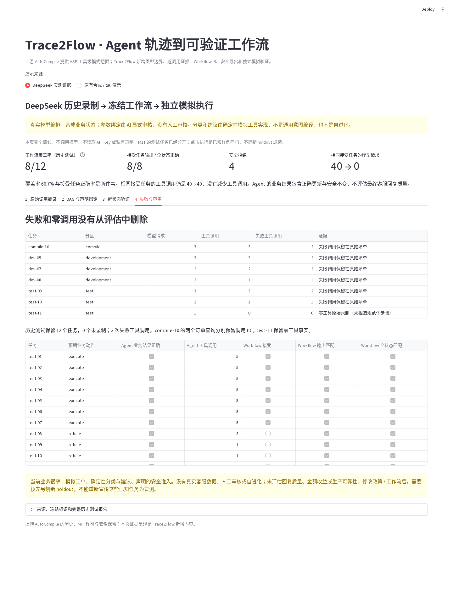

# Trace2Flow：三分钟中文演示（M12）

这不是一个新的客服平台，而是把 **Agent 已经做过的事情，变成边界明确、可以验证的工作流**。
DeepSeek 负责产生原始调用轨迹；AutoCompile 挖掘工具级模式；Trace2Flow 补逐调用证据、
声明绑定、框架独立 IR、安全导出和独立状态验证。上游核心、许可证和历史没有被重写。

## 启动

在仓库根目录运行，不需要 API Key，也不会发送模型请求：

```bash
PYTHONPATH=src .venv/bin/python -m streamlit run streamlit_app.py \
  --server.headless true --server.address 127.0.0.1 --server.port 8512 \
  --browser.gatherUsageStats false
```

浏览器打开 `http://127.0.0.1:8512`，默认选择「DeepSeek 实测证据」。
「原有合成 / tau 演示」保留原来的上传、编译和验证入口，结果范围不混用。

## 第一步：看输入，而不是从几千行 JSON 开始（约 40 秒）

点击「1 · 原始调用摘录」，默认任务是 `test-01`。

可以这样介绍：

> 输入是一份任务：工单编号、客户编号、订单编号、投诉文本和政策版本。
> Agent 当时调用了客户查询、订单查询、分类、建议和更新五个工具。
> 每次调用有独立 ID、参数、结果和状态；false 就是布尔值，不会变成字符串。

页面展示的是**原始录制的公开有损摘录**：直接保留任务与工具事实，没有模型消息、
系统提示或状态快照。它不是完整原始文件，也不是已经补入审核声明的规范化 Trace。
私有完整录制仍在忽略目录，页面不读取它；没有私有数据也能演示。
原始 SHA 与三份历史报告清单绑定；新增 `demo-index.json` 检查公开文件完整性，
但这些哈希不能证明历史提供方请求真实性。



## 第二步：看可复用结构和参数从哪来（约 50 秒）

点击「2 · DAG 与声明绑定」。

> 编译时用了九条已审核的完整轨迹。得到五个节点和三条依赖：
> 订单事实进入分类，分类进入建议，建议进入工单更新。
> 客户查询和订单查询之间没有凭调用顺序添加数据边。
> 展开每条边可以找到对应原始运行和调用 ID，不只是按工具名画图。

绑定表中，`order_id` 来自任务输入，`order_status` 来自订单工具输出；
`policy_version` 也来自任务输入，没有因为历史参数都相同就当作常量。
本例六个任务输入绑定、九个工具输出绑定、零常量、零未解决项。

必须补一句：**绑定是 AI 显式审核的未来执行合约，不是自动证明模型真实血缘；没有人工审核。**
无法确认的参数、分支或副作用必须保持未解决，并拒绝导出可执行版本。
展开底部可以下载冻结 Prefect flow；它只调用注册工具，不执行 Trace 携带的代码。


## 第三步：真正执行，并检查副作用（约 40 秒）

点击「3 · 新状态验证」，选择 `test-01`，点击「运行冻结工作流（新模拟状态）」。

> 这里不是回放录制响应。我创建全新的本地客户、订单和工单状态，
> 让冻结工作流调用模拟工具，再和预先独立声明的预期结果比较。
> 不仅最终输出要对，全部客户、订单、工单状态也要对。

本例实际更新成 `pending_carrier`，建议 `carrier_investigation`，
展示三个工单字段变化；客户和订单没有额外修改。每次点击重新创建状态。
随后选择 `test-11` 并再次执行：客户编号缺失，准入拒绝，零工具执行，全部状态不变。
准入条件是显式声明的存在 / 归属检查，不是自动挖掘的分支策略。

**点击执行是已公开任务的新状态回归，不是新的盲测，也不重新生成历史 Agent 结果。**


## 第四步：不要只展示成功（约 30 秒）

回到第一栏选择 `compile-10`：同一个订单工具失败两次，两次调用 ID 不同；
它没有纳入编译，但仍在十个编译任务的评估分母中。
再选择 `test-11`：原始 `calls=[]`，没有为了满足规范化格式捏造步骤。
点击「4 · 失败与范围」可以看三个分区的失败 / 零调用清单和全部十二个测试任务。

> 历史工作流接受 8/12，覆盖率 66.7%；接受的八个结果和全状态都正确。
> 四个被拒绝任务没有更新，不应该宣传为十二次成功更新。
> 相同八个接受任务的模型编排请求是 40 → 0，但工具调用是 40 → 40。
> 这只证明狭窄模拟业务可以去掉在线模型编排，不证明成本、生产加速或普遍泛化。







## 面试时必须说清的边界

- 模型调用是真实录制，但客户、订单、工单全部合成；不是脱敏真实客服数据。
- 模型负责工具编排，分类 / 建议是确定性模拟工具；不是通用自然语言政策编译器。
- 工作流和评分器在 M11 测试前冻结；M12 不改它们，不额外调用模型。
- 最终客服回复质量、生产可靠性、成本收益、通用分支和自进化都没有被验证。
- 调整策略或工作流后，需要另预先声明新 holdout；这些公开任务只作回归。

## 自动验证与截图复现

```bash
.venv/bin/python -m unittest discover -s tests -p test_live_demo.py -v
PYTHONPATH=src PREFECT_SERVER_ALLOW_EPHEMERAL_MODE=true \
  .venv/bin/python -m unittest discover -s tests -v
```

截图来自实际本地 Streamlit + Chromium，不是 UI 效果图。启动上面的服务器后，
可用临时工具环境复现；Playwright 不加入项目依赖，不改变 `uv.lock`：

```bash
uv venv /tmp/trace2flow-m12-browser --python .venv/bin/python
uv pip install --python /tmp/trace2flow-m12-browser/bin/python playwright
/tmp/trace2flow-m12-browser/bin/python -m playwright install chromium
/tmp/trace2flow-m12-browser/bin/python scripts/capture_m12_demo.py
```

脚本只访问本地服务器、阻止外部资源请求，并检查五节点三边、成功执行、
安全拒绝、重复失败和零调用后生成七张截图。不运行 Agent，不请求提供方。
完整实验来源见 [M11 实验说明](AGENT_EXPERIMENT.md) 与
[归档来源](../examples/customer-support-agent/live-v1/SOURCE.md)。
